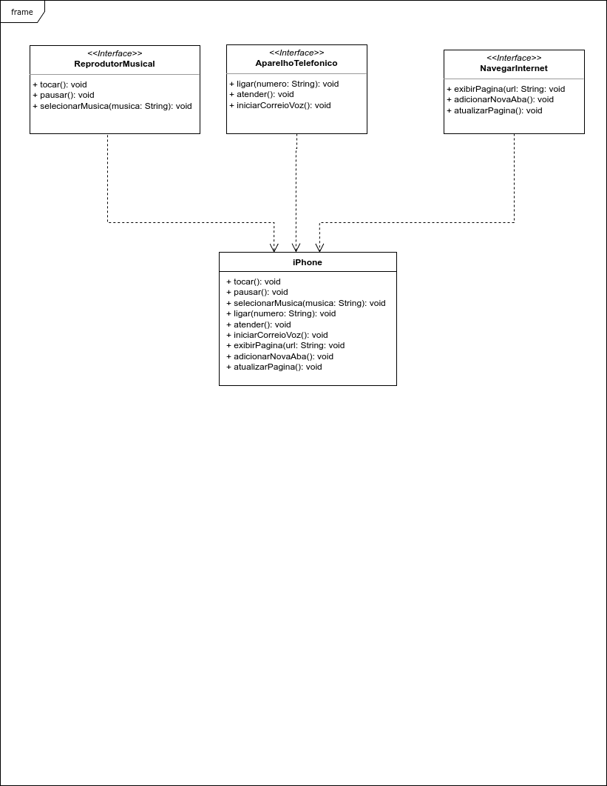

# 📱 Projeto iPhone em Java

Este é um projeto de estudo orientado a objetos que simula as principais funcionalidades de um iPhone por meio da implementação de interfaces em Java.

## 🚀 Funcionalidades Modeladas

O projeto está dividido em três funcionalidades principais, cada uma representada por uma interface:

- 🎵 **Reprodutor Musical**
  - `tocar()`
  - `pausar()`
  - `selecionarMusica(String musica)`

- 📞 **Aparelho Telefônico**
  - `ligar(String numero)`
  - `atender()`
  - `iniciarCorreioVoz()`

- 🌐 **Navegador na Internet**
  - `exibirPagina(String url)`
  - `adicionarNovaAba()`
  - `atualizarPagina()`

A classe `iPhone` implementa todas essas funcionalidades.

🖼️ Diagrama UML

